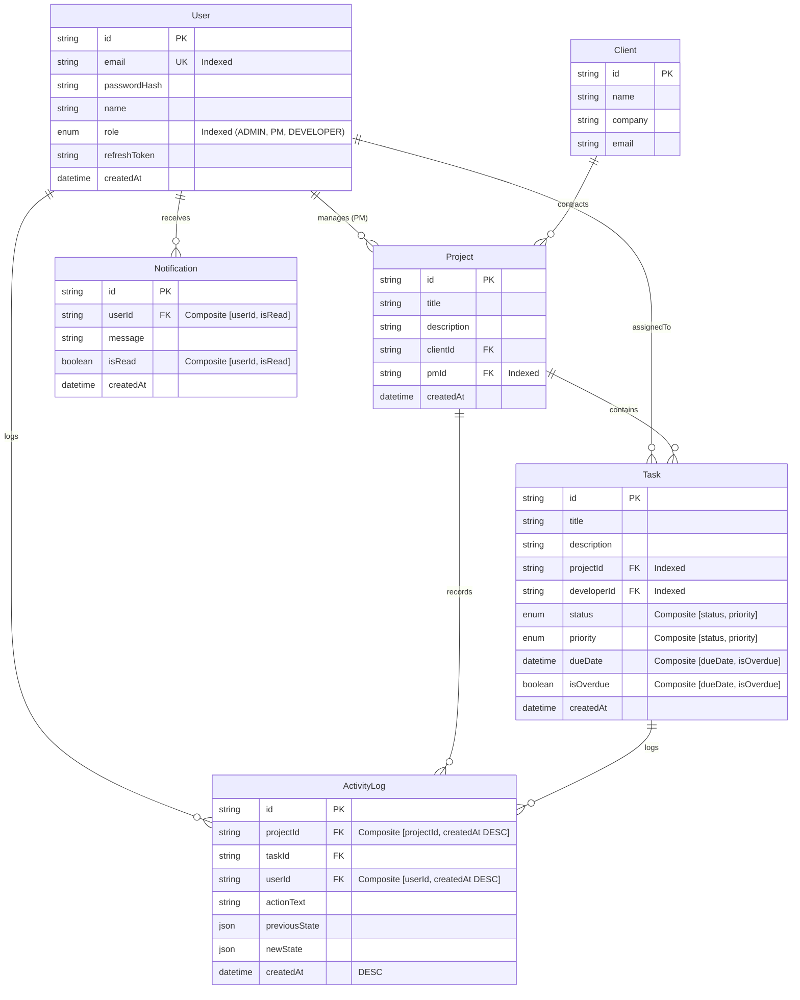

# VELOZITY GLOBAL SOLUTIONS
## Real-Time Client Project Dashboard with Role-Based Access & Live Activity Feed

> Production-grade full-stack web application for internal digital agency project management, real-time activity feeds, presence monitoring, background overdue task management, and row-level role-based authorization.

---

## 🌟 Key Features

1. **Strict Role-Based Access Control (RBAC)**:
   - **Admin**: Full access across all clients, projects, tasks, users, and the global real-time activity stream.
   - **Project Manager**: Create and manage only projects assigned to them; assign tasks; view activity and notifications for their projects only. Row-level guards strictly prevent accessing other PMs' projects.
   - **Developer**: View only assigned tasks; update task status only (`To Do → In Progress → In Review → Done`). Cannot view other developers' tasks or modify task metadata.
   - Enforced at both API middleware and PostgreSQL query levels — not just UI hiding.

2. **Real-Time Live Activity Feed & Socket Presence**:
   - Native WebSocket gateway powered by **Socket.io** with explicit room segregation (`admin_global`, `project_{projectId}`, `user_{userId}`).
   - Formatted activity stream: `"[User] moved Task '[Task Title]' from [Previous] → [Next] · [Time]"`.
   - Live presence tracking with multi-tab connection deduplication, broadcasting active online user counts in real time to Admins.
   - Database-backed offline catchup (`GET /api/activity/feed?limit=20`) to restore missed events upon reconnecting.

3. **In-App Real-Time Notification Center**:
   - In-app alerts triggered on developer task assignments and PM review requests (`IN_REVIEW`).
   - Live unread count badges and dropdown with single and bulk "Mark as Read" actions.

4. **Background Overdue Task Scheduler**:
   - Automated background scheduler (`node-cron`) running every 5 minutes.
   - Transitions past-due tasks (`dueDate < NOW()`) from active status to `isOverdue: true` directly in PostgreSQL, broadcasting updates across active rooms.

5. **Shareable URL-Persisted Filter State**:
   - Task lists synchronize status, priority, and date range filters with URL query parameters (`useSearchParams`), making filtered views bookmarkable and shareable.

---

## 🏗️ Architecture & Tech Stack

```
                                  +------------------------------------+
                                  |     React 18 + TypeScript Client   |
                                  |  - Tailwind CSS + Lucide Icons     |
                                  |  - TanStack Query v5 Cache         |
                                  |  - Socket.io Client (Room Pub/Sub) |
                                  |  - URL-Persisted Filters           |
                                  +-----------------+------------------+
                                                    |
                         +--------------------------+--------------------------+
                         | REST (Bearer JWT Access)                            | WebSocket (Handshake Auth)
                         v                                                     v
+---------------------------------------------------+    +-----------------------------------------------+
|             Node.js + Express Backend             |    |               Socket.io Server                |
|  - RBAC Middleware (Admin, PM, Developer)         |    |  - Room Segregation:                          |
|  - HttpOnly SameSite Cookie Token Rotation        |    |    * admin_global                             |
|  - Zod Server-Side Request Validation             |    |    * project_{projectId}                      |
|  - Structured Error Responses                     |    |    * user_{userId}                            |
|  - node-cron (5-min Overdue Batch Engine)         |    |  - Connection Presence Tracking Map           |
+-------------------------+-------------------------+    +-----------------------+-----------------------+
                          |                                                      |
                          +--------------------------+---------------------------+
                                                     |
                                                     v
                                  +------------------------------------+
                                  |        PostgreSQL Database         |
                                  |  - Managed via Prisma ORM          |
                                  |  - Relational Foreign Keys         |
                                  |  - Composite B-Tree Indexes        |
                                  +------------------------------------+
```

| Layer | Technologies |
| :--- | :--- |
| **Frontend** | React 18, TypeScript, Vite, Tailwind CSS, Lucide Icons, React Router v6, TanStack Query v5, Socket.io-client, Axios |
| **Backend** | Node.js, Express, TypeScript, Socket.io, CORS, Cookie-Parser, Zod, node-cron, bcryptjs, jsonwebtoken |
| **Database** | PostgreSQL 16+ with Prisma ORM (relational constraints, explicit composite indexes) |
| **Authentication** | Short-lived Access Token (15m, in memory/headers) + Long-lived Refresh Token (7d, HttpOnly, Secure, SameSite cookie) |

---

## 📐 Database Schema & Indexing Justification



### Indexing Decisions
1. `User.email` & `User.role`: High-frequency lookups during authentication and role filtering.
2. `Project.pmId`: Supports row-level filtering where PMs view only projects they own (`WHERE pmId = ?`).
3. `Task.projectId` & `Task.developerId`: Essential for fast foreign-key joins and filtering tasks assigned to a specific developer.
4. `Task(status, priority)`: Composite B-tree index optimizes dashboard queries sorting tasks by priority and filtering by status.
5. `Task(dueDate, isOverdue)`: Composite index heavily accelerates the 5-minute background cron query (`WHERE dueDate < NOW() AND isOverdue = false`).
6. `ActivityLog(projectId, createdAt DESC)` & `ActivityLog(userId, createdAt DESC)`: Directly powers the 20-item missed events catchup query and live stream initialization without table scans.
7. `Notification(userId, isRead)`: Accelerates real-time unread count badges (`COUNT(*) WHERE userId = ? AND isRead = false`).

---

## 🏛️ Architectural Decisions

### 1. WebSocket Gateway: Socket.io vs Native WebSocket
- **Decision**: Socket.io configured strictly over native WebSocket transport (`transports: ['websocket']`).
- **Rationale**: Socket.io provides production-tested room segregation (`io.to(room).emit()`), automatic exponential backoff reconnection, handshake authentication middleware, and cross-tab socket aggregation. Implementing dynamic room multiplexing, presence deduplication, and reconnect synchronization over raw `ws` would introduce boilerplate without operational benefits.

### 2. Job Queue: node-cron vs BullMQ
- **Decision**: `node-cron` with transactional batch updates.
- **Rationale**: The scheduling requirement consists of a periodic recurring batch audit (evaluating all overdue tasks across the database every 5 minutes). `node-cron` achieves this with low overhead without requiring Redis as a secondary caching tier. If distributed horizontal worker pools were required, Redis-backed BullMQ would be chosen.

### 3. Token Security & Storage
- **Decision**: Access Token (15m expiry) sent via HTTP `Authorization: Bearer <token>` header + Refresh Token (7d expiry) persisted in an `HttpOnly`, `Secure`, `SameSite=Lax` cookie.
- **Rationale**: Storing refresh tokens in `localStorage` exposes sessions to Cross-Site Scripting (XSS). HttpOnly cookies prevent client-side JavaScript access. The Axios client transparently negotiates token rotation upon encountering 401 status codes.

---

## 🚀 Quick Start & Local Setup

### Option 1: Docker (Recommended)

Ensure Docker & Docker Compose are installed, then run:

```bash
# Clone and enter project directory
cd client-project-dashboard

# Start PostgreSQL, Backend, and Frontend containers
docker compose up --build -d

# Seed the database inside the backend container
docker compose exec backend npm run prisma:seed
```

- **Frontend**: http://localhost:80
- **Backend API**: http://localhost:5000/api
- **Health Check**: http://localhost:5000/health

---

### Option 2: Native Setup (Node.js & Local PostgreSQL)

#### Prerequisites
- Node.js v18+
- PostgreSQL server running on port 5432

#### 1. Backend Setup
```bash
cd backend
npm install

# Configure .env (already preset for localhost postgres)
cp .env.example .env

# Push schema to PostgreSQL & generate Prisma Client
npx prisma db push

# Seed database with users, projects, tasks, overdue states & activity logs
npm run prisma:seed

# Start backend development server
npm run dev
```

#### 2. Frontend Setup
```bash
cd ../frontend
npm install

# Start Vite frontend server
npm run dev
```

Open your browser at `http://localhost:5173`.

---

## 🔑 Pre-Seeded Test Credentials

Use the **One-Click Persona Switcher** on the login page or top navigation bar, or manually sign in:

| Role | Name | Email | Password | Scope |
| :--- | :--- | :--- | :--- | :--- |
| **Admin** | Aman Sharma | `admin@velozity.com` | `Password123!` | Global access, all projects, live presence |
| **Project Manager** | Sarah Chen | `sarah.pm@velozity.com` | `Password123!` | Projects 1 & 3, task assignment |
| **Project Manager** | Marcus Vance | `marcus.pm@velozity.com` | `Password123!` | Project 2, cannot view Sarah's projects |
| **Developer** | Ravi Kumar | `ravi.dev@velozity.com` | `Password123!` | Tasks assigned to Ravi only, status edits |
| **Developer** | Elena Rostova | `elena.dev@velozity.com` | `Password123!` | Tasks assigned to Elena only |

---

## 📝 Technical Assessment Reflection

### Explanation (150–250 words)

The most intricate challenge in this project was architecting the real-time role-filtered activity feed with seamless offline catchup. In multi-tenant agency management, naive global broadcasting leaks proprietary client data to unauthorized project managers and developers. 

To solve this, I designed a hierarchical room topology: `admin_global` for executive oversight, `project_{projectId}` for project-scoped activity, and `user_{userId}` for targeted in-app notifications. Upon WebSocket handshake, the server authenticates the JWT, determines the user's role, and dynamically binds socket connections to their authorized project rooms. When a developer moves a task status, the backend atomically persists the mutation in PostgreSQL, writes an immutable audit record to `ActivityLog`, and dispatches the event exclusively to the affected project room and the admin channel. If the transition reaches `IN_REVIEW`, a notification is dispatched specifically to the project manager's private channel.

For offline catchup, rather than relying on volatile in-memory ring buffers, reconnecting clients query `GET /api/activity/feed?limit=20`. This endpoint utilizes composite B-tree indexes on `(projectId, createdAt DESC)` to retrieve missed historical events from PostgreSQL filtered by row-level ownership.

If doing this differently in a high-scale production deployment, I would decouple WebSocket state using Redis Streams and a Redis Pub/Sub adapter across clustered Node instances. This would support horizontal server scaling, eliminate single-node presence bottlenecks, and provide cross-cluster message brokering.

---

## 🛡️ Known Limitations
1. Single-node in-memory socket presence tracking (ready to be swapped with Redis adapter for multi-instance clusters).
2. Rate limiting can be added with `express-rate-limit` for DDoS mitigation in public staging environments.
